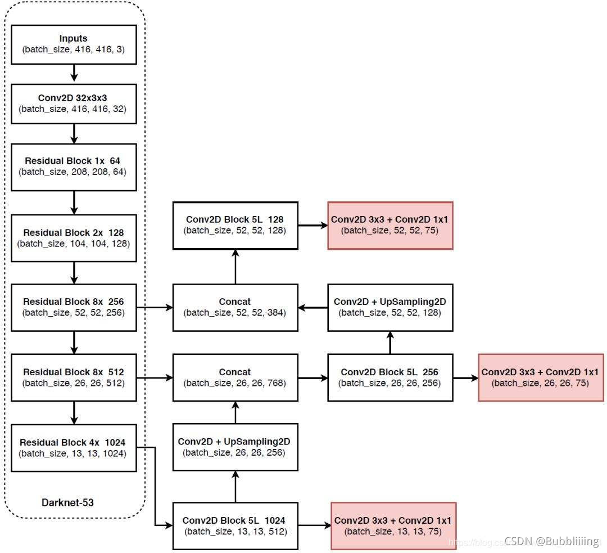
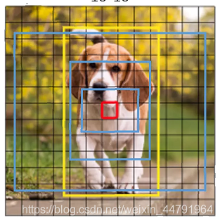

# 1


# 分成3种网格大小


# 源码下载

https://github.com/bubbliiiing/yolo3-pytorch
 喜欢的可以点个star噢。


## 一、预测部分

### 1、darknet53



> 13,13,1024 经过5次卷积(Block 5L), 分类预测和回归预测(进行两次卷积)得到 13,13,75
>
> 13,13,75 => 13,13,3,25 => 13,13,3,20+1+4
>
> 大小为13的网格,3代表3个先验框,20代表20分类的概率,1代表先验框是否包含物体,4代表先验框调整参数

 YoloV3所使用的主干特征提取网络为Darknet53，它具有两个重要特点：

1、Darknet53具有一个重要特点是使用了**残差网络Residual**，Darknet53中的残差卷积就是**首先进行一次卷积核大小为3X3、步长为2的卷积，该卷积会压缩输入进来的特征层的宽和高，此时我们可以获得一个特征层，我们将该特征层命名为layer。之后我们再对该特征层进行一次1X1的卷积和一次3X3的卷积，并把这个结果加上layer，此时我们便构成了残差结构**。通过**不断的1X1卷积和3X3卷积以及残差边的叠加，我们便大幅度的加深了网络**。残差网络的特点是**容易优化**，并且能够通过增加相当的**深度来提高准确率**。其内部的**残差块使用了跳跃连接，缓解了在深度神经网络中增加深度带来的梯度消失问题。**

2、Darknet53的每一个卷积部分**使用了特有的DarknetConv2D结构**，每一次卷积的时候进行l2正则化，**完成卷积后进行BatchNormalization标准化与LeakyReLU。普通的ReLU是将所有的负值都设为零，Leaky ReLU则是给所有负值赋予一个非零斜率。以数学的方式我们可以表示为**：


> nets/darknet.py

```python
"""
LeakyReLU
"""

import math
from collections import OrderedDict

import torch.nn as nn


#---------------------------------------------------------------------#
#   残差结构
#   利用一个1x1卷积下降通道数，然后利用一个3x3卷积提取特征并且上升通道数
#   最后接上一个残差边
#---------------------------------------------------------------------#
class BasicBlock(nn.Module):
    def __init__(self, planes):
        """
        没有降采样和通道变化,不然没法相加
        inplanes: in_channel 等于planes[1]  删除了,使用了plane[1]
        planes: list,两个卷积的out_channel
        """
        super().__init__()
        self.conv1  = nn.Conv2d(planes[1], planes[0], kernel_size=1, stride=1, padding=0, bias=False)
        self.bn1    = nn.BatchNorm2d(planes[0])
        self.relu1  = nn.LeakyReLU(0.1)

        self.conv2  = nn.Conv2d(planes[0], planes[1], kernel_size=3, stride=1, padding=1, bias=False)
        self.bn2    = nn.BatchNorm2d(planes[1])
        self.relu2  = nn.LeakyReLU(0.1)

    def forward(self, x):
        residual = x

        out = self.conv1(x)
        out = self.bn1(out)
        out = self.relu1(out)

        out = self.conv2(out)
        out = self.bn2(out)
        out = self.relu2(out)

        out += residual
        return out

# 416,416,3 -> 13,13,1024
class DarkNet(nn.Module):
    def __init__(self, layers):
        """
        layers: 5层的重复次数
        """
        super().__init__()
        self.inplanes = 32
        # 416,416,3 -> 416,416,32
        self.conv1  = nn.Conv2d(3, self.inplanes, kernel_size=3, stride=1, padding=1, bias=False)
        self.bn1    = nn.BatchNorm2d(self.inplanes)
        self.relu1  = nn.LeakyReLU(0.1)

        # 416,416,32 -> 208,208,64   中间通道,进出通道
        self.layer1 = self._make_layer([32, 64], layers[0])
        # 208,208,64 -> 104,104,128
        self.layer2 = self._make_layer([64, 128], layers[1])
        # 104,104,128 -> 52,52,256
        self.layer3 = self._make_layer([128, 256], layers[2])
        # 52,52,256 -> 26,26,512
        self.layer4 = self._make_layer([256, 512], layers[3])
        # 26,26,512 -> 13,13,1024
        self.layer5 = self._make_layer([512, 1024], layers[4])

        # 所有层的out_channels
        self.layers_out_filters = [64, 128, 256, 512, 1024]

        # 进行权值初始化
        for m in self.modules():
            if isinstance(m, nn.Conv2d):
                n = m.kernel_size[0] * m.kernel_size[1] * m.out_channels
                m.weight.data.normal_(0, math.sqrt(2. / n))
            elif isinstance(m, nn.BatchNorm2d):
                m.weight.data.fill_(1)
                m.bias.data.zero_()

    #---------------------------------------------------------------------#
    #   在每一个layer里面，首先利用一个步长为2的3x3卷积进行下采样
    #   然后进行残差结构的堆叠
    #---------------------------------------------------------------------#
    def _make_layer(self, planes, repeats):
        """
        planes: list,BasicBlock中两个卷积的out_channel
        repeats: 重复次数
        """
        layers = []
        # 下采样，步长为2，卷积核大小为3
        layers.append(("ds_conv", nn.Conv2d(self.inplanes, planes[1], kernel_size=3, stride=2, padding=1, bias=False)))
        layers.append(("ds_bn", nn.BatchNorm2d(planes[1])))
        layers.append(("ds_relu", nn.LeakyReLU(0.1)))
        self.inplanes = planes[1]   # in_channel就是BasicBlock的out_channel

        # 加入残差结构
        for i in range(0, repeats):
            layers.append(("residual_{}".format(i), BasicBlock(planes)))
        return nn.Sequential(OrderedDict(layers))

    def forward(self, x):
        x = self.conv1(x)
        x = self.bn1(x)
        x = self.relu1(x)

        x = self.layer1(x)
        x = self.layer2(x)
        out3 = self.layer3(x)       # 52,52,256
        out4 = self.layer4(out3)    # 26,26,512
        out5 = self.layer5(out4)    # 13,13,1024

        return out3, out4, out5

def darknet53():
    model = DarkNet([1, 2, 8, 8, 4])
    return model
```


### 2、从特征获取预测结果


从**特征获取预测结果的过程**可以分为两个部分，分别是：

- 构建**FPN特征金字塔进行加强特征提取**。
- 利用**Yolo Head对三个有效特征层进行预测**。

#### a、构建FPN特征金字塔进行加强特征提取

在特征利用部分，YoloV3提取**多特征层进行目标检测**，一共**提取三个特征层**。

三个特征层位于主干部分Darknet53的不同位置，分别位于**中间层，中下层，底层**，三个特征层的**shape分别为(52,52,256)、(26,26,512)、(13,13,1024)。**

在获得三个有效特征层后，我们利用这三个有效特征层进行FPN层的构建，构建方式为：

1. 13x13x1024的特征层进行5次卷积处理，处理完后**利用YoloHead获得预测结果**，**一部分用于进行上采样UmSampling2d后与26x26x512特征层进行结合**，结合特征层的shape为(26,26,768)。
2. 结合特征层再次进行5次卷积处理，处理完后**利用YoloHead获得预测结果**，**一部分用于进行上采样UmSampling2d后与52x52x256特征层进行结合**，结合特征层的shape为(52,52,384)。
3. 结合特征层再次进行5次卷积处理，处理完后**利用YoloHead获得预测结果**。

特征金字塔可以将**不同shape的特征层进行特征融合**，有利于**提取出更好的特征**。

#### b、利用Yolo Head获得预测结果

利用FPN特征金字塔，**我们可以获得三个加强特征，这三个加强特征的shape分别为(13,13,512)、(26,26,256)、(52,52,128)，然后我们利用这三个shape的特征层传入Yolo Head获得预测结果。**

Yolo Head本质上是一次3x3卷积加上一次1x1卷积，3x3卷积的作用是特征整合，1x1卷积的作用是调整通道数。

对三个特征层分别进行处理，假设我们预测是的VOC数据集，我们的输出层的shape分别为(**13,13,75**)，(**26,26,75**)，(**52,52,75**)，**最后一个维度为75是因为该图是基于voc数据集的，它的类为20种，YoloV3针对每一个特征层的每一个特征点存在3个先验框，所以预测结果的通道数为3x25；**

**如果使用的是coco训练集，类则为80种，最后的维度应该为255 = 3x85**，三个特征层的shape为(**13,13,255**)，(**26,26,255**)，(**52,52,255**)

其实际情况就是，输入N张416x416的图片，在经过多层的运算后，会输出三个shape分别为(**N,13,13,255**)，(**N,26,26,255**)，(**N,52,52,255**)的数据，对应每个图分为13x13、26x26、52x52的网格上3个先验框的位置。

> nets/yolo.py

```python
"""
LeakyReLU
"""

from collections import OrderedDict

import torch
import torch.nn as nn

from nets.darknet import darknet53

# conv+bn+relu
def conv2d(filter_in, filter_out, kernel_size):
    pad = (kernel_size - 1) // 2 if kernel_size else 0
    return nn.Sequential(OrderedDict([
        ("conv", nn.Conv2d(filter_in, filter_out, kernel_size=kernel_size, stride=1, padding=pad, bias=False)),
        ("bn", nn.BatchNorm2d(filter_out)),
        ("relu", nn.LeakyReLU(0.1)),
    ]))

#------------------------------------------------------------------------#
#   make_last_layers里面一共有七个卷积，前五个用于提取特征。
#   后两个用于获得yolo网络的预测结果
#------------------------------------------------------------------------#
def make_last_layers(filters_list, in_filters, out_filter):
    """
    filters_list: 维度变化列表
    in_filters:   in_channels
    out_filter:   最终conv的out_channels

    """
    m = nn.Sequential(
        conv2d(in_filters,     filters_list[0], 1),     # 1 降低通道
        conv2d(filters_list[0], filters_list[1], 3),    # 3 提取特征
        conv2d(filters_list[1], filters_list[0], 1),
        conv2d(filters_list[0], filters_list[1], 3),
        conv2d(filters_list[1], filters_list[0], 1),
        conv2d(filters_list[0], filters_list[1], 3),
        nn.Conv2d(filters_list[1], out_filter, kernel_size=1, stride=1, padding=0, bias=True)
    )
    return m

class YoloBody(nn.Module):
    def __init__(self, anchors_mask, num_classes, pretrained = False):
        """
        anchors_mask: [[6, 7, 8], [3, 4, 5], [0, 1, 2]] 用于帮助代码找到对应的先验框
        """
        super().__init__()
        #---------------------------------------------------#
        #   生成darknet53的主干模型
        #   获得三个有效特征层，他们的shape分别是：
        #   52,52,256
        #   26,26,512
        #   13,13,1024
        #---------------------------------------------------#
        self.backbone = darknet53()
        if pretrained:
            self.backbone.load_state_dict(torch.load("model_data/darknet53_backbone_weights.pth"))

        #---------------------------------------------------#
        #   out_filters : [64, 128, 256, 512, 1024]
        #---------------------------------------------------#
        out_filters = self.backbone.layers_out_filters

        #------------------------------------------------------------------------#
        #   计算yolo_head的输出通道数，对于voc数据集而言
        #   final_out_filter0 = final_out_filter1 = final_out_filter2 = 75
        #   anchors_mask[0]) * (num_classes + 5) = 3 * 25 = 75
        #------------------------------------------------------------------------#
        # 13,13,1024 -> 13,13,512 -> 13,13,75          维度变化列表  in_channels      最终conv的out_channels
        self.last_layer0            = make_last_layers([512, 1024], out_filters[-1], len(anchors_mask[0]) * (num_classes + 5))

        # 13,13,512 -> 13,13,256 -> 26,26,256
        self.last_layer1_conv       = conv2d(512, 256, 1)
        self.last_layer1_upsample   = nn.Upsample(scale_factor=2, mode='nearest')
        # 26,26,512+256 -> 26,26,256 -> 26,26,75
        self.last_layer1            = make_last_layers([256, 512], out_filters[-2] + 256, len(anchors_mask[1]) * (num_classes + 5))

        # 26,26,256 -> 26,26,128 -> 52,52,128
        self.last_layer2_conv       = conv2d(256, 128, 1)
        self.last_layer2_upsample   = nn.Upsample(scale_factor=2, mode='nearest')
        # 52,52,256+128 -> 52,52,75
        self.last_layer2            = make_last_layers([128, 256], out_filters[-3] + 128, len(anchors_mask[2]) * (num_classes + 5))

    def forward(self, x):
        #---------------------------------------------------#
        #   获得三个有效特征层，他们的shape分别是：
        #   52,52,256；26,26,512；13,13,1024
        #---------------------------------------------------#
        x2, x1, x0 = self.backbone(x)

        #---------------------------------------------------#
        #   第一个特征层
        #   out0 = (b,75,13,13)
        #---------------------------------------------------#
        # 13,13,1024 -> 13,13,512
        out0_branch = self.last_layer0[:5](x0)              # 前5次特征提取,要上采样拼接
        # 13,13,512 -> 13,13,512
        out0        = self.last_layer0[5:](out0_branch)     # 后2次利用YoloHead获得预测结果

        # 13,13,512 -> 13,13,256 -> 26,26,256
        x1_in = self.last_layer1_conv(out0_branch)
        x1_in = self.last_layer1_upsample(x1_in)

        # 26,26,256 + 26,26,512 -> 26,26,768
        x1_in = torch.cat([x1_in, x1], 1)

        #---------------------------------------------------#
        #   第二个特征层
        #   out1 = (b,75,26,26)
        #---------------------------------------------------#
        # 26,26,768 -> 26,26,256
        out1_branch = self.last_layer1[:5](x1_in)
        # 26,26,256 -> 26,26,75
        out1        = self.last_layer1[5:](out1_branch)

        # 26,26,256 -> 26,26,128 -> 52,52,128
        x2_in = self.last_layer2_conv(out1_branch)
        x2_in = self.last_layer2_upsample(x2_in)

        # 52,52,128 + 52,52,256 -> 52,52,384
        x2_in = torch.cat([x2_in, x2], 1)

        #---------------------------------------------------#
        #   第三个特征层
        #   out3 = (b,75,52,52)
        #---------------------------------------------------#
        # 52,52,384 -> 52,52,128 -> 52,52,256 -> 52,52,128 -> 52,52,256 -> 52,52,128 -> 52,52,256 -> 52,52,75
        out2 = self.last_layer2(x2_in)
        return out0, out1, out2
```


### 3、预测结果的解码

由第二步我们可以获得三个特征层的预测结果，shape分别为：

- (**N,13,13,255**)
- (**N,26,26,255**)
- (**N,52,52,255**)

在这里我们简单了解一下每个有效特征层到底做了什么：

每一个有效特征层将整个图片分成与其**长宽对应的网格**，**如(N,13,13,255)的特征层就是将整个图像分成13x13个网格；然后从每个网格中心建立多个先验框，这些框是网络预先设定好的框，网络的预测结果会判断这些框内是否包含物体，以及这个物体的种类。**

由于每一个网格点都具有三个先验框，所以上述的预测结果可以reshape为：

- (**N,13,13,3,85**)
- (**N,26,26,3,85**)
- (**N,52,52,3,85**)

**其中的85可以拆分为4+1+80，其中的4代表先验框的调整参数，1代表先验框内是否包含物体，80代表的是这个先验框的种类，由于coco分了80类，所以这里是80**。如果YoloV3只检测两类物体，那么这个85就变为了4+1+2 = 7。

即85包含了4+1+80，**分别代表x_offset、y_offset、h和w、置信度、分类结果。**

但是这个预测结果并不对应着最终的预测框在图片上的位置，还需要解码才可以完成。

YoloV3的解码过程分为两步：

- 先**将每个网格点加上它对应的x_offset和y_offset**，加完后的结果就是**预测框的中心**。

    > 默认的先验框的中心是下图中网格交叉点的坐标,我们将预测中心调整到0~1之间,进行相加,就能把坐标点向右下的方框中调整,
    >
    > 调整之后就是预测框的中心了

- 然后**再利用 先验框和h、w结合 计算出预测框的宽高**。这样就能得到整个预测框的位置了。




得到最终的预测结果后还要进行**得分排序与非极大抑制筛选**。

这一部分基本上是所有目标检测通用的部分。其对于每一个类进行判别：
 **1、取出每一类得分大于self.obj_threshold的框和得分。
 2、利用框的位置和得分进行非极大抑制。**

> utils/utils_bbox.py

```python
import torch
import torch.nn as nn
from torchvision.ops import nms
import numpy as np

"""
对yolo的结果进行解码
"""
class DecodeBox():
    def __init__(self, anchors, num_classes, input_shape, anchors_mask = [[6,7,8], [3,4,5], [0,1,2]]):
        super().__init__()
        self.anchors        = anchors           # 先验框
        self.num_classes    = num_classes
        self.bbox_attrs     = 5 + num_classes
        self.input_shape    = input_shape       # 原始图像大小
        #-----------------------------------------------------------#
        #   13x13的特征层对应的anchor是[116,90],[156,198],[373,326]
        #   26x26的特征层对应的anchor是[30,61],[62,45],[59,119]
        #   52x52的特征层对应的anchor是[10,13],[16,30],[33,23]
        #-----------------------------------------------------------#
        self.anchors_mask   = anchors_mask

    def decode_box(self, inputs):
        """
        inputs: out0, out1, out2
                13    26    52
        """
        outputs = []
        for i, input in enumerate(inputs):
            #-----------------------------------------------#
            #   输入的input一共有三个，他们的shape分别是
            #   b, 75, 13, 13
            #   b, 75, 26, 26
            #   b, 75, 52, 52
            #-----------------------------------------------#
            # 卷积后图片数,高宽
            batch_size      = input.size(0)
            input_height    = input.size(2)
            input_width     = input.size(3)

            #-----------------------------------------------#
            #   调整步长,一次找多少像素,每个特征点对应原图多少个像素
            #   输入为416x416时
            #   stride_h = stride_w = 416/13=32、416/26=16、416/52=8
            #-----------------------------------------------#
            stride_h = self.input_shape[0] / input_height
            stride_w = self.input_shape[1] / input_width
            #-------------------------------------------------#
            #   调整anchor的宽高到相对于特征层的大小(除以步长即可)
            #   此时获得的scaled_anchors大小是相对于特征层的
            #-------------------------------------------------#
            scaled_anchors = [(anchor_width / stride_w, anchor_height / stride_h) for anchor_width, anchor_height in self.anchors[self.anchors_mask[i]]]

            #-----------------------------------------------#
            #   reshape: b, 75, 13, 13 => b, 3, 25, 13, 13
            #   输入的input一共有三个，他们的shape分别是
            #   b, 3, 25, 13, 13
            #   b, 3, 25, 26, 26
            #   b, 3, 25, 52, 52
            #   再将框(2维)的内容变换到最后维度
            #   b, 3, 13, 13, 25  25=4+1+20 4代表x_offset, y_offset, h, w 1代表置信度
            #-----------------------------------------------#
            prediction = input.view(batch_size, len(self.anchors_mask[i]), self.bbox_attrs, input_height, input_width).permute(0, 1, 3, 4, 2).contiguous()

            #-----------------------------------------------#
            #   先验框的中心位置的调整参数
            #   sigmoid固定到0~1之间,每个框的中心点是按照分隔后的最近的左上角点,就是物体位置由网格左上角来负责预测
            #   调整到0~1之间就是坐标点的移动位置在右下角的方框内
            #-----------------------------------------------#
            x = torch.sigmoid(prediction[..., 0])
            y = torch.sigmoid(prediction[..., 1])
            #-----------------------------------------------#
            #   先验框的宽高调整参数
            #-----------------------------------------------#
            w = prediction[..., 2]
            h = prediction[..., 3]
            #-----------------------------------------------#
            #   获得置信度，是否有物体
            #-----------------------------------------------#
            conf        = torch.sigmoid(prediction[..., 4])
            #-----------------------------------------------#
            #   种类置信度
            #   0~1之间,表示可能性
            #-----------------------------------------------#
            pred_cls    = torch.sigmoid(prediction[..., 5:])

            FloatTensor = torch.cuda.FloatTensor if x.is_cuda else torch.FloatTensor
            LongTensor  = torch.cuda.LongTensor if x.is_cuda else torch.LongTensor

            """
            下面要生成默认的先验框,然后使用预测结果进行位置调整
            """
            #----------------------------------------------------------#
            #   生成先验框网格，先验框中心，网格左上角
            #   b,3,13,13 代表13x13的网格上每个网格都有3个先验框
            #----------------------------------------------------------#
            grid_x = torch.linspace(0, input_width - 1, input_width).repeat(input_height, 1).repeat(
                batch_size * len(self.anchors_mask[i]), 1, 1).view(x.shape).type(FloatTensor)
            grid_y = torch.linspace(0, input_height - 1, input_height).repeat(input_width, 1).t().repeat(
                batch_size * len(self.anchors_mask[i]), 1, 1).view(y.shape).type(FloatTensor)

            #----------------------------------------------------------#
            #   按照先验框网格格式生成先验框的宽高
            #   b,3,13,13
            #----------------------------------------------------------#
            anchor_w = FloatTensor(scaled_anchors).index_select(1, LongTensor([0]))
            anchor_h = FloatTensor(scaled_anchors).index_select(1, LongTensor([1]))
            anchor_w = anchor_w.repeat(batch_size, 1).repeat(1, 1, input_height * input_width).view(w.shape)
            anchor_h = anchor_h.repeat(batch_size, 1).repeat(1, 1, input_height * input_width).view(h.shape)

            """
            利用预测值对默认先验框进行调整
            """
            #----------------------------------------------------------#
            #   利用预测结果对默认先验框进行调整
            #   首先调整先验框的中心，从先验框中心向右下角偏移
            #   再调整先验框的宽高。
            #----------------------------------------------------------#
            pred_boxes          = FloatTensor(prediction[..., :4].shape)
            pred_boxes[..., 0]  = x.data + grid_x   # x,y是预测中心, grid_x,grid_y是默认框的位置,相加就能获取位置,将左上角向右下移动
            pred_boxes[..., 1]  = y.data + grid_y
            pred_boxes[..., 2]  = torch.exp(w.data) * anchor_w  # w,h是预测宽高,anchor_w,anchor_h是默认框的宽高
            pred_boxes[..., 3]  = torch.exp(h.data) * anchor_h  # 指数乘以原值

            #----------------------------------------------------------#
            #   将输出结果归一化成小数的形式
            #----------------------------------------------------------#
            _scale = torch.Tensor([input_width, input_height, input_width, input_height]).type(FloatTensor)
            output = torch.cat((pred_boxes.view(batch_size, -1, 4) / _scale,
                                conf.view(batch_size, -1, 1), pred_cls.view(batch_size, -1, self.num_classes)), -1)
            outputs.append(output.data)
        return outputs

    """
    去除图片灰条
    """
    def yolo_correct_boxes(self, box_xy, box_wh, input_shape, image_shape, letterbox_image):
        #-----------------------------------------------------------------#
        #   把y轴放前面是因为方便预测框和图像的宽高进行相乘
        #-----------------------------------------------------------------#
        box_yx = box_xy[..., ::-1]
        box_hw = box_wh[..., ::-1]
        input_shape = np.array(input_shape)
        image_shape = np.array(image_shape)

        if letterbox_image:
            #-----------------------------------------------------------------#
            #   这里求出来的offset是图像有效区域相对于图像左上角的偏移情况
            #   new_shape指的是宽高缩放情况
            #-----------------------------------------------------------------#
            new_shape = np.round(image_shape * np.min(input_shape/image_shape))
            offset  = (input_shape - new_shape)/2./input_shape
            scale   = input_shape/new_shape

            box_yx  = (box_yx - offset) * scale
            box_hw *= scale

        box_mins    = box_yx - (box_hw / 2.)
        box_maxes   = box_yx + (box_hw / 2.)
        boxes  = np.concatenate([box_mins[..., 0:1], box_mins[..., 1:2], box_maxes[..., 0:1], box_maxes[..., 1:2]], axis=-1)
        boxes *= np.concatenate([image_shape, image_shape], axis=-1)
        return boxes

    """
    非极大抑制,筛选出一定区域内属于同一种类得分最大的框
    """
    def non_max_suppression(self, prediction, num_classes, input_shape, image_shape, letterbox_image, conf_thres=0.5, nms_thres=0.4):
        #----------------------------------------------------------#
        #   将预测结果的格式转换成左上角右下角的格式。  y1,x1,y2,x2
        #   prediction: [batch_size, num_anchors, 25]
        #----------------------------------------------------------#
        box_corner          = prediction.new(prediction.shape)
        box_corner[:, :, 0] = prediction[:, :, 0] - prediction[:, :, 2] / 2     # x1
        box_corner[:, :, 1] = prediction[:, :, 1] - prediction[:, :, 3] / 2     # y1
        box_corner[:, :, 2] = prediction[:, :, 0] + prediction[:, :, 2] / 2     # x2
        box_corner[:, :, 3] = prediction[:, :, 1] + prediction[:, :, 3] / 2     # y2
        prediction[:, :, :4] = box_corner[:, :, :4]                             # 替换前4个数据换成左上角右下角的格式

        output = [None for _ in range(len(prediction))]

        #----------------------------------------------------------#
        #   循环图片,一张图片一次
        #----------------------------------------------------------#
        for i, image_pred in enumerate(prediction):
            #----------------------------------------------------------#
            #   image_pred[:, 5:5 + num_classes] 取出分类信息
            #   对种类预测部分取max。
            #   class_conf  [num_anchors, 1]    种类置信度
            #   class_pred  [num_anchors, 1]    种类
            #----------------------------------------------------------#
            class_conf, class_pred = torch.max(image_pred[:, 5:5 + num_classes], 1, keepdim=True)

            #----------------------------------------------------------#
            #   利用置信度进行第一轮筛选,是否大于门限,返回0/1
            #   image_pred[:, 4] * class_conf[:, 0]  是否包含物体 * 置信度 得到最后的置信度
            #----------------------------------------------------------#
            conf_mask = (image_pred[:, 4] * class_conf[:, 0] >= conf_thres).squeeze()

            #----------------------------------------------------------#
            #   根据置信度进行预测结果的筛选,使用0/1筛选
            #----------------------------------------------------------#
            image_pred = image_pred[conf_mask]  # 网络预测结果
            class_conf = class_conf[conf_mask]  # 种类置信度
            class_pred = class_pred[conf_mask]  # 种类
            if not image_pred.size(0):
                continue

            #-------------------------------------------------------------------------#
            #   堆叠位置参数,是否有物体,种类置信度,种类
            #   detections  [num_anchors, 7]
            #   7的内容为：x1, y1, x2, y2, obj_conf(是否包含物体置信度), class_conf(种类置信度), class_pred(种类预测值)
            #-------------------------------------------------------------------------#
            detections = torch.cat((image_pred[:, :5], class_conf.float(), class_pred.float()), 1)

            #------------------------------------------#
            #   获得预测结果中包含的所有种类
            #------------------------------------------#
            unique_labels = detections[:, -1].cpu().unique()    # 种类.unique减少后面的循环

            if prediction.is_cuda:
                unique_labels = unique_labels.cuda()
                detections = detections.cuda()

            # 循环所有预测的种类
            for c in unique_labels:
                #------------------------------------------#
                #   获得某一类得分筛选后全部的预测结果
                #------------------------------------------#
                detections_class = detections[detections[:, -1] == c]

                #------------------------------------------#
                #   使用官方自带的非极大抑制会速度更快一些！
                #------------------------------------------#
                keep = nms(
                    detections_class[:, :4],                            # 坐标,中心+宽高
                    detections_class[:, 4] * detections_class[:, 5],    # 得分 4代表是否有物体,5代表置信度
                    nms_thres
                )
                max_detections = detections_class[keep]

                # # 按照存在物体的置信度排序
                # _, conf_sort_index = torch.sort(detections_class[:, 4]*detections_class[:, 5], descending=True)
                # detections_class = detections_class[conf_sort_index]
                # # 进行非极大抑制
                # max_detections = []
                # while detections_class.size(0):
                #     # 取出这一类置信度最高的，一步一步往下判断，判断重合程度是否大于nms_thres，如果是则去除掉
                #     max_detections.append(detections_class[0].unsqueeze(0))
                #     if len(detections_class) == 1:
                #         break
                #     ious = bbox_iou(max_detections[-1], detections_class[1:])
                #     detections_class = detections_class[1:][ious < nms_thres]
                # # 堆叠
                # max_detections = torch.cat(max_detections).data

                # Add max detections to outputs
                output[i] = max_detections if output[i] is None else torch.cat((output[i], max_detections))

            # 去除图片灰条
            if output[i] is not None:
                output[i]           = output[i].cpu().numpy()
                box_xy, box_wh      = (output[i][:, 0:2] + output[i][:, 2:4])/2, output[i][:, 2:4] - output[i][:, 0:2]
                output[i][:, :4]    = self.yolo_correct_boxes(box_xy, box_wh, input_shape, image_shape, letterbox_image)
        return output

```

### 4、在原图上进行绘制

通过第三步，我们可以获得预测框在原图上的位置，而且这些预测框都是经过筛选的。这些筛选后的框可以直接绘制在图片上，就可以获得结果了。

### 先验框

> yolo3每个网格有3个先验框
>
> 先验框四个参数是 中心和高宽
>
> xml中是 左上角,右下角坐标的形式,因此要转换


## 二、训练部分

### 1、计算loss所需参数

在计算loss的时候，实际上是pred和target之间的对比：

**pred就是网络的预测结果。
 target就是网络的真实框情况。**

### 2、pred是什么

对于yolo3的模型来说，网络**最后输出的内容就是三个特征层每个网格点对应的预测框及其种类**，即三个特征层分别对应着图片被分为不同size的网格后，**每个网格点上三个先验框对应的位置、置信度及其种类。**

输出层的shape分别为(**13,13,75**)，(**26,26,75**)，(**52,52,75**)，**最后一个维度为75是因为是基于voc数据集的，它的类为20种，yolo3只有针对每一个特征层存在3个先验框，所以最后维度为3x25；如果使用的是coco训练集，类则为80种，最后的维度应该为255 = 3x85**，三个特征层的shape为(**13,13,255**)，(**26,26,255**)，(**52,52,255**)

现在的y_pre还是没有解码的，解码了之后才是真实图像上的情况。

### 3、target是什么。

target就是一个真实图像中，真实框的情况。
 第一个维度是batch_size，第二个维度是每一张图片里面真实框的数量，第三个维度内部是真实框的信息，包括位置以及种类。

### 4、loss的计算过程

拿到pred和target后，不可以简单的减一下作为对比，需要进行如下步骤。

1. 判断真实框在图片中的位置，判断其属于哪一个网格点去检测。判断真实框和这个特征点的哪个先验框重合程度最高。计算该网格点应该有怎么样的预测结果才能获得真实框，与真实框重合度最高的先验框被用于作为正样本。
2. 根据网络的预测结果获得预测框，计算预测框和所有真实框的重合程度，如果重合程度大于一定门限，则将该预测框对应的先验框忽略。其余作为负样本。
3. 最终损失由三个部分组成：a、**正样本，编码后的长宽与xy轴偏移量与预测值的差距**。b、**正样本，预测结果中置信度的值与1对比；负样本，预测结果中置信度的值与0对比**。c、**实际存在的框，种类预测结果与实际结果的对比**。

> nets/yolo_training.py

```python
import torch
import torch.nn as nn
import math
import numpy as np

"""
计算yolo的损失
"""
class YOLOLoss(nn.Module):
    def __init__(self, anchors, num_classes, input_shape, cuda, anchors_mask = [[6,7,8], [3,4,5], [0,1,2]]):
        super(YOLOLoss, self).__init__()
        #-----------------------------------------------------------#
        #   13x13的特征层对应的anchor是[116,90],[156,198],[373,326]
        #   26x26的特征层对应的anchor是[30,61],[62,45],[59,119]
        #   52x52的特征层对应的anchor是[10,13],[16,30],[33,23]
        #-----------------------------------------------------------#
        self.anchors        = anchors
        self.num_classes    = num_classes
        self.bbox_attrs     = 5 + num_classes   # 每个框的属性 4+1+num_classes
        self.input_shape    = input_shape
        self.anchors_mask   = anchors_mask

        self.ignore_threshold = 0.5
        self.cuda = cuda

    def clip_by_tensor(self, t, t_min, t_max):
        t = t.float()
        result = (t >= t_min).float() * t + (t < t_min).float() * t_min
        result = (result <= t_max).float() * result + (result > t_max).float() * t_max
        return result

    # 均方误差,回归问题
    def MSELoss(self, pred, target):
        return torch.pow(pred - target, 2)

    # pred经过sigmoid就使用BCELoss,一般应用于二分类
    def BCELoss(self, pred, target):
        epsilon = 1e-7
        pred    = self.clip_by_tensor(pred, epsilon, 1.0 - epsilon)
        output  = - target * torch.log(pred) - (1.0 - target) * torch.log(1.0 - pred)
        return output

    def forward(self, l, input, targets=None):
        #----------------------------------------------------#
        #   l代表的是，当前输入进来的有效特征层是第几个有效特征层
        #   input是当前特征层的输出
        #   input的shape为  b, 3*(5+num_classes), 13, 13
        #                   b, 3*(5+num_classes), 26, 26
        #                   b, 3*(5+num_classes), 52, 52
        #   targets代表的是真实框。
        #----------------------------------------------------#
        #--------------------------------#
        #   获得图片数量(batch_size)，特征层的高和宽
        #   hw: 13x13
        #--------------------------------#
        bs      = input.size(0)
        in_h    = input.size(2)
        in_w    = input.size(3)
        #-----------------------------------------------------------------------#
        #   计算步长,一次找多少像素,每个特征点对应原图多少个像素
        #   每一个特征点对应原来的图片上多少个像素点
        #   如果特征层为13x13的话，一个特征点就对应原来的图片上的32个像素点
        #   如果特征层为26x26的话，一个特征点就对应原来的图片上的16个像素点
        #   如果特征层为52x52的话，一个特征点就对应原来的图片上的8个像素点
        #   stride_h = stride_w = 416/13=32、416/26=16、416/52=8
        #   stride_h和stride_w都是32。
        #-----------------------------------------------------------------------#
        stride_h = self.input_shape[0] / in_h
        stride_w = self.input_shape[1] / in_w
        #-------------------------------------------------#
        #   调整anchor的宽高到相对于特征层的大小(除以步长即可)
        #   此时获得的scaled_anchors大小是相对于特征层的
        #-------------------------------------------------#
        scaled_anchors  = [(a_w / stride_w, a_h / stride_h) for a_w, a_h in self.anchors]
        #-----------------------------------------------#
        #   输入的input一共有三个，他们的shape分别是
        #   b, 3*(5+num_classes), 13, 13 => b, 3, 13, 13, 5 + num_classes
        #   b, 3, 26, 26, 5 + num_classes
        #   b, 3, 52, 52, 5 + num_classes
        #   5 + num_classes = 4 + 1 + num_classes  4代表x_offset, y_offset, h, w 1代表置信度
        #-----------------------------------------------#
        prediction = input.view(bs, len(self.anchors_mask[l]), self.bbox_attrs, in_h, in_w).permute(0, 1, 3, 4, 2).contiguous()

        #-----------------------------------------------#
        #   先验框的中心位置的调整参数
        #   sigmoid固定到0~1之间,每个框的中心点是按照分隔后的最近的左上角点为重心,就是物体位置由网格左上角来负责预测
        #   调整到0~1之间就是坐标点的移动位置在右下角的方框内
        #-----------------------------------------------#
        x = torch.sigmoid(prediction[..., 0])
        y = torch.sigmoid(prediction[..., 1])
        #-----------------------------------------------#
        #   先验框的宽高调整参数
        #-----------------------------------------------#
        w = prediction[..., 2]
        h = prediction[..., 3]
        #-----------------------------------------------#
        #   获得置信度，是否有物体
        #-----------------------------------------------#
        conf = torch.sigmoid(prediction[..., 4])
        #-----------------------------------------------#
        #   种类置信度
        #   0~1之间,表示可能性
        #-----------------------------------------------#
        pred_cls = torch.sigmoid(prediction[..., 5:])

        #-----------------------------------------------#
        #   获得网络应该有的预测结果
        #-----------------------------------------------#
        y_true, noobj_mask, box_loss_scale = self.get_target(l, targets, scaled_anchors, in_h, in_w)

        #---------------------------------------------------------------#
        #   获得网络应该忽略的特征点,重合率高的忽略,重合率低的设为负样本
        #   将预测结果进行解码，判断预测结果和真实值的重合程度
        #   如果重合程度过大则忽略，因为这些特征点属于预测比较准确的特征点
        #   作为负样本不合适
        #----------------------------------------------------------------#
        noobj_mask = self.get_ignore(l, x, y, h, w, targets, scaled_anchors, in_h, in_w, noobj_mask)

        if self.cuda:
            y_true          = y_true.cuda()
            noobj_mask      = noobj_mask.cuda()
            box_loss_scale  = box_loss_scale.cuda()
        #-----------------------------------------------------------#
        #   reshape_y_true[...,2:3]和reshape_y_true[...,3:4]
        #   表示真实框的宽高，二者均在0-1之间
        #   真实框越大，比重越小，小框的比重更大。
        #-----------------------------------------------------------#
        box_loss_scale = 2 - box_loss_scale
        #-----------------------------------------------------------#
        #   计算中心偏移情况的loss，使用BCELoss效果好一些
        #   x,y计算了sigmoid,不能使用均方误差,要使用BCELoss
        #-----------------------------------------------------------#
        loss_x = torch.sum(self.BCELoss(x, y_true[..., 0]) * box_loss_scale * y_true[..., 4])
        loss_y = torch.sum(self.BCELoss(y, y_true[..., 1]) * box_loss_scale * y_true[..., 4])
        #-----------------------------------------------------------#
        #   计算宽高调整值的loss
        #   MSELoss是均方误差
        #-----------------------------------------------------------#
        loss_w = torch.sum(self.MSELoss(w, y_true[..., 2]) * 0.5 * box_loss_scale * y_true[..., 4])
        loss_h = torch.sum(self.MSELoss(h, y_true[..., 3]) * 0.5 * box_loss_scale * y_true[..., 4])
        #-----------------------------------------------------------#
        #   计算置信度的loss = 正样本loss + 负样本loss
        #   计算了sigmoid,不能使用均方误差,要使用BCELoss
        #-----------------------------------------------------------#
        loss_conf   = torch.sum(self.BCELoss(conf, y_true[..., 4]) * y_true[..., 4]) + \
                      torch.sum(self.BCELoss(conf, y_true[..., 4]) * noobj_mask)
        #-----------------------------------------------------------#
        #   分类损失,不使用交叉熵,用的是BCELoss
        #-----------------------------------------------------------#
        loss_cls    = torch.sum(self.BCELoss(pred_cls[y_true[..., 4] == 1], y_true[..., 5:][y_true[..., 4] == 1]))

        # loss总和
        loss        = loss_x  + loss_y + loss_w + loss_h + loss_conf + loss_cls
        # 正样本数量
        num_pos = torch.sum(y_true[..., 4])
        num_pos = torch.max(num_pos, torch.ones_like(num_pos))
        return loss, num_pos

    def calculate_iou(self, _box_a, _box_b):
        #-----------------------------------------------------------#
        #   计算真实框的左上角和右下角
        #-----------------------------------------------------------#
        b1_x1, b1_x2 = _box_a[:, 0] - _box_a[:, 2] / 2, _box_a[:, 0] + _box_a[:, 2] / 2
        b1_y1, b1_y2 = _box_a[:, 1] - _box_a[:, 3] / 2, _box_a[:, 1] + _box_a[:, 3] / 2
        #-----------------------------------------------------------#
        #   计算先验框获得的预测框的左上角和右下角
        #-----------------------------------------------------------#
        b2_x1, b2_x2 = _box_b[:, 0] - _box_b[:, 2] / 2, _box_b[:, 0] + _box_b[:, 2] / 2
        b2_y1, b2_y2 = _box_b[:, 1] - _box_b[:, 3] / 2, _box_b[:, 1] + _box_b[:, 3] / 2

        #-----------------------------------------------------------#
        #   将真实框和预测框都转化成左上角右下角的形式
        #-----------------------------------------------------------#
        box_a = torch.zeros_like(_box_a)
        box_b = torch.zeros_like(_box_b)
        box_a[:, 0], box_a[:, 1], box_a[:, 2], box_a[:, 3] = b1_x1, b1_y1, b1_x2, b1_y2
        box_b[:, 0], box_b[:, 1], box_b[:, 2], box_b[:, 3] = b2_x1, b2_y1, b2_x2, b2_y2

        #-----------------------------------------------------------#
        #   A为真实框的数量，B为先验框的数量
        #-----------------------------------------------------------#
        A = box_a.size(0)
        B = box_b.size(0)

        #-----------------------------------------------------------#
        #   计算交的面积
        #-----------------------------------------------------------#
        max_xy  = torch.min(box_a[:, 2:].unsqueeze(1).expand(A, B, 2), box_b[:, 2:].unsqueeze(0).expand(A, B, 2))
        min_xy  = torch.max(box_a[:, :2].unsqueeze(1).expand(A, B, 2), box_b[:, :2].unsqueeze(0).expand(A, B, 2))
        inter   = torch.clamp((max_xy - min_xy), min=0)
        inter   = inter[:, :, 0] * inter[:, :, 1]
        #-----------------------------------------------------------#
        #   计算预测框和真实框各自的面积
        #-----------------------------------------------------------#
        area_a = ((box_a[:, 2]-box_a[:, 0]) * (box_a[:, 3]-box_a[:, 1])).unsqueeze(1).expand_as(inter)  # [A,B]
        area_b = ((box_b[:, 2]-box_b[:, 0]) * (box_b[:, 3]-box_b[:, 1])).unsqueeze(0).expand_as(inter)  # [A,B]
        #-----------------------------------------------------------#
        #   求IOU
        #-----------------------------------------------------------#
        union = area_a + area_b - inter
        return inter / union  # [A,B]

    """获得网络应该有的预测结果"""
    def get_target(self, l, targets, anchors, in_h, in_w):
        #-----------------------------------------------------#
        #   计算一共有多少张图片 batch_size
        #-----------------------------------------------------#
        bs              = len(targets)
        #-----------------------------------------------------#
        #   用于选取哪些先验框不包含物体
        #   b, 3, h, w   len(self.anchors_mask[l])=3 3中先验框
        #   默认为1,认为全不包含物体
        #-----------------------------------------------------#
        noobj_mask      = torch.ones(bs, len(self.anchors_mask[l]), in_h, in_w, requires_grad = False)
        #-----------------------------------------------------#
        #   增强小目标权重,减小大目标权重,让网络更加去关注小目标
        #-----------------------------------------------------#
        box_loss_scale  = torch.zeros(bs, len(self.anchors_mask[l]), in_h, in_w, requires_grad = False)
        #-----------------------------------------------------#
        #   batch_size, 3, 13, 13, 5 + num_classes
        #-----------------------------------------------------#
        y_true          = torch.zeros(bs, len(self.anchors_mask[l]), in_h, in_w, self.bbox_attrs, requires_grad = False)
        for b in range(bs):
            if len(targets[b])==0:
                continue
            batch_target = torch.zeros_like(targets[b])
            #-------------------------------------------------------#
            #   计算出正样本在特征层上的中心点
            #-------------------------------------------------------#
            batch_target[:, [0,2]] = targets[b][:, [0,2]] * in_w    # 真实框是归一化的,要乘以宽高
            batch_target[:, [1,3]] = targets[b][:, [1,3]] * in_h
            batch_target[:, 4] = targets[b][:, 4]
            batch_target = batch_target.cpu()

            #-------------------------------------------------------#
            #   将真实框转换一个形式
            #   num_true_box, 4
            #-------------------------------------------------------#
            gt_box          = torch.FloatTensor(torch.cat((torch.zeros((batch_target.size(0), 2)), batch_target[:, 2:4]), 1))
            #-------------------------------------------------------#
            #   将先验框转换一个形式
            #   9, 4
            #-------------------------------------------------------#
            anchor_shapes   = torch.FloatTensor(torch.cat((torch.zeros((len(anchors), 2)), torch.FloatTensor(anchors)), 1))
            #-------------------------------------------------------#
            #   计算真实框和先验框交并比IoU
            #   self.calculate_iou(gt_box, anchor_shapes) = [num_true_box, 9] 每一个真实框和9个先验框的重合情况
            #   best_ns: 二维
            #    [每个真实框最大的重合度max_iou, 每一个真实框最重合的先验框的序号]
            #   argmax应该只返回下标,要返回两个值应该使用max
            #-------------------------------------------------------#
            best_ns = torch.argmax(self.calculate_iou(gt_box, anchor_shapes), dim=-1)

            for t, best_n in enumerate(best_ns):
                # t:最大重合度的值 best_n:最重合的先验框的序号

                # 判断当前先验框是否属于这一层
                if best_n not in self.anchors_mask[l]:
                    continue
                #----------------------------------------#
                #   判断这个先验框是当前特征点的哪一个先验框
                #----------------------------------------#
                k = self.anchors_mask[l].index(best_n)      # c通道
                #----------------------------------------#
                #   获得真实框属于哪个网格点
                #----------------------------------------#
                i = torch.floor(batch_target[t, 0]).long()  # w通道
                j = torch.floor(batch_target[t, 1]).long()  # h通道
                #----------------------------------------#
                #   取出真实框的种类
                #----------------------------------------#
                c = batch_target[t, 4].long()

                #----------------------------------------#
                #   noobj_mask代表无目标的特征点
                #----------------------------------------#
                noobj_mask[b, k, j, i] = 0
                #----------------------------------------#
                #   tx、ty代表中心调整参数的真实值
                #----------------------------------------#
                y_true[b, k, j, i, 0] = batch_target[t, 0] - i.float()  # x_offset
                y_true[b, k, j, i, 1] = batch_target[t, 1] - j.float()  # y_offset
                y_true[b, k, j, i, 2] = math.log(batch_target[t, 2] / anchors[best_n][0])   # h
                y_true[b, k, j, i, 3] = math.log(batch_target[t, 3] / anchors[best_n][1])   # w
                y_true[b, k, j, i, 4] = 1                               # 先验框有包含物体
                y_true[b, k, j, i, c + 5] = 1                           # 先验框物体种类
                #----------------------------------------#
                #   用于获得xywh的比例
                #   大目标loss权重小，小目标loss权重大
                #----------------------------------------#
                box_loss_scale[b, k, j, i] = batch_target[t, 2] * batch_target[t, 3] / in_w / in_h
        return y_true, noobj_mask, box_loss_scale

    """获得网络应该忽略的特征点,重合率高的忽略,重合率低的设为负样本"""
    def get_ignore(self, l, x, y, h, w, targets, scaled_anchors, in_h, in_w, noobj_mask):
        # 对预测结果进行解码,一直到for循环
        #-----------------------------------------------------#
        #   计算一共有多少张图片
        #-----------------------------------------------------#
        bs = len(targets)

        FloatTensor = torch.cuda.FloatTensor if x.is_cuda else torch.FloatTensor
        LongTensor  = torch.cuda.LongTensor if x.is_cuda else torch.LongTensor
        #-----------------------------------------------------#
        #   生成网格，先验框中心，网格左上角
        #-----------------------------------------------------#
        grid_x = torch.linspace(0, in_w - 1, in_w).repeat(in_h, 1).repeat(
            int(bs * len(self.anchors_mask[l])), 1, 1).view(x.shape).type(FloatTensor)
        grid_y = torch.linspace(0, in_h - 1, in_h).repeat(in_w, 1).t().repeat(
            int(bs * len(self.anchors_mask[l])), 1, 1).view(y.shape).type(FloatTensor)

        # 生成先验框的宽高
        scaled_anchors_l = np.array(scaled_anchors)[self.anchors_mask[l]]
        anchor_w = FloatTensor(scaled_anchors_l).index_select(1, LongTensor([0]))
        anchor_h = FloatTensor(scaled_anchors_l).index_select(1, LongTensor([1]))

        anchor_w = anchor_w.repeat(bs, 1).repeat(1, 1, in_h * in_w).view(w.shape)
        anchor_h = anchor_h.repeat(bs, 1).repeat(1, 1, in_h * in_w).view(h.shape)
        #-------------------------------------------------------#
        #   计算调整后的先验框中心与宽高
        #-------------------------------------------------------#
        pred_boxes_x    = torch.unsqueeze(x.data + grid_x, -1)
        pred_boxes_y    = torch.unsqueeze(y.data + grid_y, -1)
        pred_boxes_w    = torch.unsqueeze(torch.exp(w.data) * anchor_w, -1)
        pred_boxes_h    = torch.unsqueeze(torch.exp(h.data) * anchor_h, -1)
        pred_boxes      = torch.cat([pred_boxes_x, pred_boxes_y, pred_boxes_w, pred_boxes_h], dim = -1)

        for b in range(bs):
            #-------------------------------------------------------#
            #   将预测结果转换一个形式
            #   pred_boxes_for_ignore      num_anchors, 4
            #-------------------------------------------------------#
            pred_boxes_for_ignore = pred_boxes[b].view(-1, 4)
            #-------------------------------------------------------#
            #   计算真实框，并把真实框转换成相对于特征层的大小
            #   gt_box      num_true_box, 4
            #-------------------------------------------------------#
            if len(targets[b]) > 0:
                batch_target = torch.zeros_like(targets[b])
                #-------------------------------------------------------#
                #   计算出正样本在特征层上的中心点
                #-------------------------------------------------------#
                batch_target[:, [0,2]] = targets[b][:, [0,2]] * in_w
                batch_target[:, [1,3]] = targets[b][:, [1,3]] * in_h
                batch_target = batch_target[:, :4]
                #-------------------------------------------------------#
                #   计算交并比
                #   anch_ious       num_true_box, num_anchors
                #-------------------------------------------------------#
                anch_ious = self.calculate_iou(batch_target, pred_boxes_for_ignore)
                #-------------------------------------------------------#
                #   每个先验框对应真实框的最大重合度
                #   anch_ious_max   num_anchors
                #-------------------------------------------------------#
                anch_ious_max, _    = torch.max(anch_ious, dim = 0)
                anch_ious_max       = anch_ious_max.view(pred_boxes[b].size()[:3])
                # 如果重合率较高就要忽略
                noobj_mask[b][anch_ious_max > self.ignore_threshold] = 0
        return noobj_mask

def weights_init(net, init_type='normal', init_gain = 0.02):
    def init_func(m):
        classname = m.__class__.__name__
        if hasattr(m, 'weight') and classname.find('Conv') != -1:
            if init_type == 'normal':
                torch.nn.init.normal_(m.weight.data, 0.0, init_gain)
            elif init_type == 'xavier':
                torch.nn.init.xavier_normal_(m.weight.data, gain=init_gain)
            elif init_type == 'kaiming':
                torch.nn.init.kaiming_normal_(m.weight.data, a=0, mode='fan_in')
            elif init_type == 'orthogonal':
                torch.nn.init.orthogonal_(m.weight.data, gain=init_gain)
            else:
                raise NotImplementedError('initialization method [%s] is not implemented' % init_type)
        elif classname.find('BatchNorm2d') != -1:
            torch.nn.init.normal_(m.weight.data, 1.0, 0.02)
            torch.nn.init.constant_(m.bias.data, 0.0)
    print('initialize network with %s type' % init_type)
    net.apply(init_func)

```

